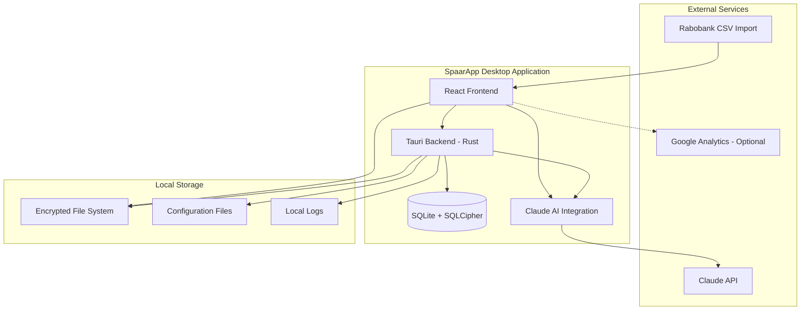

# SpaarApp Architecture Overview

## System Architecture

SpaarApp follows a **desktop-first architecture** with a focus on **privacy**, **performance**, and **accessibility**. The application is built using **Tauri 2.0** for secure cross-platform desktop applications with a modern web frontend.

## High-Level Architecture



## Core Components

### 1. Frontend (React + TypeScript)
- **Framework**: React 18 with TypeScript
- **UI Library**: Material-UI (MUI) v5
- **State Management**: Zustand
- **Routing**: React Router v6
- **Charts**: Recharts + MUI X Charts
- **Forms**: React Hook Form with Yup validation

**Key Features:**
- ADHD-optimized UI with minimal cognitive load
- Responsive design for different screen sizes
- Accessibility-first approach (WCAG 2.1 AA+)
- Real-time data synchronization
- Progressive disclosure of complex features

### 2. Backend (Rust + Tauri)
- **Framework**: Tauri 2.0
- **Language**: Rust 2021 Edition
- **Database**: SQLite with SQLCipher encryption
- **HTTP Client**: Reqwest with TLS
- **Async Runtime**: Tokio

**Key Features:**
- Secure financial data processing
- Bank-grade encryption for all data
- Claude Agent SDK integration
- CSV parsing and validation
- Local API server for frontend communication

### 3. AI Integration Layer
- **Primary AI**: Claude Sonnet 4.5
- **Backup AI**: OpenAI GPT-4.1
- **SDK**: Claude Agent SDK for Rust
- **Cost Management**: Real-time usage tracking

**AI Capabilities:**
- Transaction categorization
- Spending pattern analysis
- Personalized financial advice
- Budget optimization suggestions
- Anomaly detection

### 4. Database Layer
- **Primary DB**: SQLite with SQLCipher
- **Encryption**: AES-256 encryption
- **Backup Strategy**: Encrypted local backups
- **Migration**: Version-controlled schema migrations

**Data Schema:**
```sql
-- Core tables
accounts (id, name, type, bank_name, encrypted_credentials)
transactions (id, account_id, date, amount, description, category, metadata)
categories (id, name, color, icon, parent_id)
budgets (id, name, period, amount, start_date)
goals (id, name, target_amount, current_amount, deadline)

-- AI analysis tables
ai_insights (id, user_id, insight_type, content, created_at)
spending_patterns (id, category_id, pattern_data, confidence_score)
recommendations (id, user_id, recommendation_type, priority, status)
```

## Security Architecture

### Data Protection
- **Encryption at Rest**: SQLCipher with user-provided keys
- **Encryption in Transit**: TLS 1.3 for all external communications
- **Memory Protection**: Secure memory handling for sensitive data
- **Key Management**: Windows Credential Manager integration

### Privacy Controls
- **Local-First**: All data stored locally by default
- **Optional Analytics**: Opt-in anonymous usage statistics
- **Data Minimization**: Only collect necessary financial data
- **User Control**: Complete data export and deletion capabilities

### Compliance
- **GDPR Ready**: Privacy by design implementation
- **Financial Regulations**: Compliant with Dutch financial software requirements
- **Accessibility**: WCAG 2.1 AA+ certified interface

## Performance Architecture

### Optimization Strategies
- **Lazy Loading**: Components and data loaded on demand
- **Virtual Scrolling**: Efficient handling of large transaction lists
- **Background Processing**: Non-blocking AI analysis
- **Caching**: Intelligent caching of frequently accessed data

### Resource Management
- **Memory Usage**: Optimized for systems with 4GB+ RAM
- **Storage**: Efficient database design with automatic cleanup
- **CPU**: Background tasks scheduled during idle time
- **Network**: Minimal external API calls with offline support

## Development Architecture

### Code Organization
```
spaarapp/
├── frontend/           # React UI components
│   ├── src/
│   │   ├── components/  # Reusable UI components
│   │   ├── pages/      # Main application pages
│   │   ├── hooks/      # Custom React hooks
│   │   ├── utils/      # Utility functions
│   │   └── types/      # TypeScript type definitions
│   └── public/         # Static assets
├── backend/            # Rust backend logic
│   ├── src/
│   │   ├── main.rs     # Tauri application entry
│   │   ├── commands/   # Tauri commands for frontend
│   │   ├── models/     # Data models and structs
│   │   ├── services/   # Business logic services
│   │   ├── database/   # Database operations
│   │   └── ai/         # AI integration layer
│   └── Cargo.toml      # Rust dependencies
└── shared/             # Shared types and utilities
    ├── src/
    │   ├── types.rs    # Shared data types
    │   └── utils.rs    # Shared utility functions
    └── Cargo.toml
```

### Development Workflow
- **Hot Reload**: Instant feedback during development
- **Type Safety**: End-to-end TypeScript integration
- **Testing**: Unit tests, integration tests, and E2E tests
- **Code Quality**: Automated linting and formatting
- **Documentation**: Comprehensive API and user documentation

## Integration Architecture

### External Systems

#### Rabobank Integration
- **Method**: CSV file import (current)
- **Future**: Direct API integration (planned)
- **Format Support**: Rabobank CSV format, ISO 20022
- **Validation**: Transaction validation and deduplication

#### Claude AI Integration
- **SDK**: Claude Agent SDK for Rust
- **Authentication**: Secure API key management
- **Rate Limiting**: Built-in request throttling
- **Cost Control**: Real-time usage tracking and limits

#### Future Integrations
- **Other Banks**: ING, ABN AMRO, ASN Bank
- **Accounting Software**: Yuki, Exact Online
- **Payment Systems**: iDEAL, credit card imports
- **Investment Platforms**: DEGIRO, BinckBank

## Deployment Architecture

### Distribution Strategy
- **Platform**: Windows 10/11 (primary)
- **Package**: MSI installer with code signing
- **Updates**: Automatic delta updates
- **Installation**: Single executable with embedded resources

### Build Pipeline
- **Frontend**: Vite build optimization
- **Backend**: Cargo release compilation
- **Bundling**: Tauri bundling with resource optimization
- **Testing**: Automated test suite execution
- **Security**: Vulnerability scanning and dependency checks

## Monitoring & Observability

### Application Monitoring
- **Error Tracking**: Local error logging and optional crash reporting
- **Performance Metrics**: Application performance monitoring
- **Usage Analytics**: Opt-in anonymous usage statistics
- **Health Checks**: System health and diagnostic tools

### Debugging Support
- **Developer Tools**: Built-in debugging interface
- **Log Management**: Structured logging with multiple levels
- **Diagnostic Tools**: Database and system diagnostic utilities
- **Export Support**: Debug data export for troubleshooting

This architecture ensures SpaarApp provides a secure, performant, and accessible financial management solution specifically designed for users with ADHD while maintaining enterprise-grade security and privacy standards.